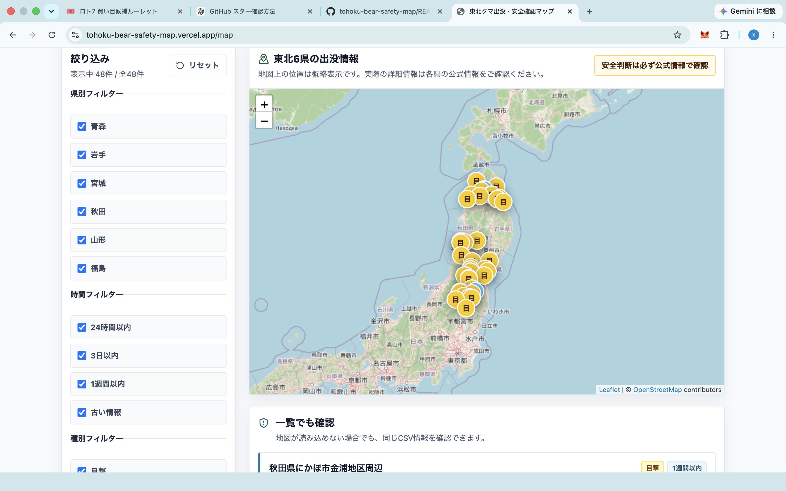
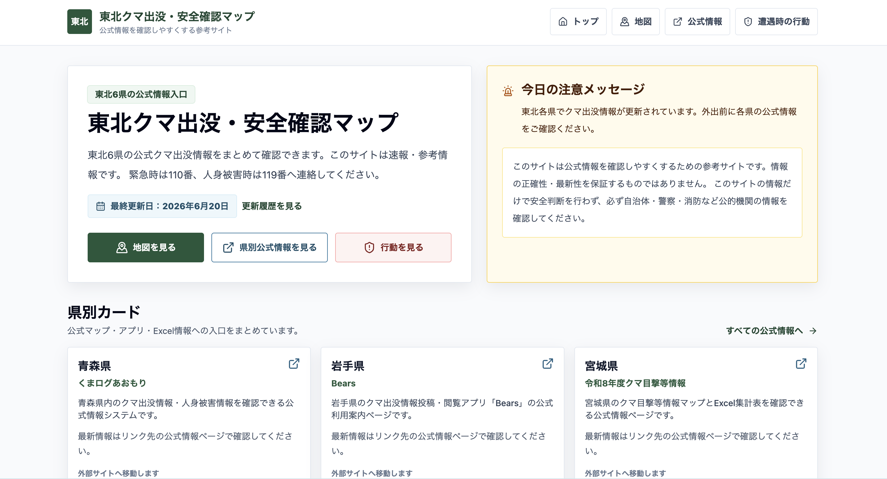
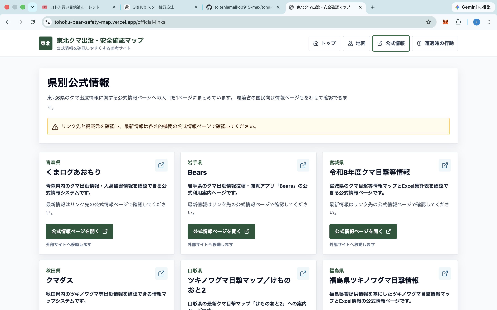
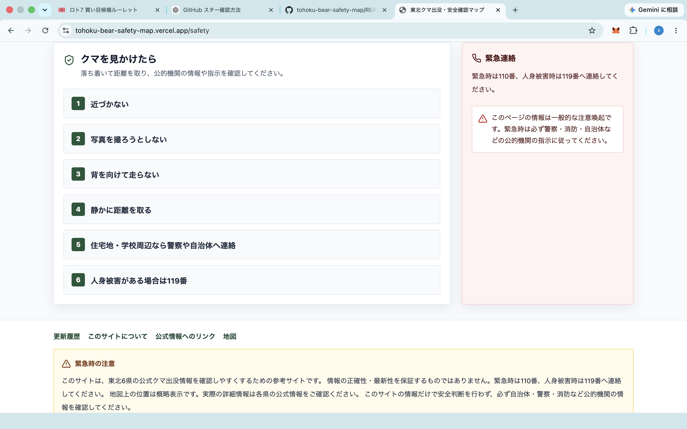

# Tohoku Bear Safety Map

An open-source map project for visualizing bear-related safety information in Japan's Tohoku region.

## Overview

Tohoku Bear Safety Map is an open-source project designed to make bear-related safety information easier to understand through a map-based interface.

This project is intended for residents, travelers, hikers, outdoor workers, and local communities who need a clearer way to understand bear-related safety information in the Tohoku region of Japan.

## Why This Project Matters

Bear sightings and human-wildlife safety issues are becoming increasingly important in many areas of Japan.

However, local safety information is often scattered across multiple sources, making it difficult for people to quickly understand the situation at a glance.

This project aims to organize and visualize bear-related safety information in a simple, accessible, and easy-to-understand way.

## Features

* Visualizes bear-related safety information on a map
* Organizes safety information by prefecture and area
* Helps users understand potential risk zones
* Provides a foundation for future open data integration
* Supports future multilingual information sharing
* Encourages clearer access to official public safety information

## Screenshots

### Map View

### Home View

### Detail View

### Mobile View

## How to Use

1. Open the application.
2. Check bear-related safety information on the map.
3. Review safety information by prefecture or area.
4. When necessary, confirm the latest information from official local government or public safety sources.

## Live Demo

https://tohoku-bear-safety-map.vercel.app

## Roadmap

* Add more regional public safety data
* Improve map design and usability
* Add date-based filtering
* Add location search functionality
* Add multilingual documentation
* Improve the data structure for contributors
* Add clearer source attribution for official information
* Improve accessibility and mobile usability

## Planned Use of AI / Codex

This project plans to use Codex and OpenAI API credits to improve the quality, maintainability, accessibility, and reliability of the codebase.

Planned use cases include:

* Reviewing and improving code quality
* Refactoring data structures for public safety information
* Generating and improving documentation
* Supporting multilingual documentation and user-facing text
* Reviewing potential security and reliability issues
* Improving developer workflows for future open-source contributions
* Making the project easier to maintain as an open-source public safety tool

The goal is to make Tohoku Bear Safety Map easier to maintain, safer to use, and more accessible to residents, travelers, hikers, outdoor workers, and local communities.

## Tech Stack

* TypeScript
* Next.js
* CSS
* Map-based UI

## Contribution

Suggestions, improvements, and feedback are welcome.

Examples of possible contributions include:

* Improving documentation
* Adding public data sources
* Improving the map UI
* Translating documentation or user-facing text
* Reporting bugs
* Providing usability feedback
* Improving data structure and source attribution

## Disclaimer

This project is an informational and educational reference tool.

Do not rely only on this website when making safety decisions. Always confirm the latest information from official sources such as local governments, police, fire departments, and other public authorities.

In Japan, call 110 for police emergencies and 119 for fire, rescue, or medical emergencies.

## Maintainer

Maintained by toitenlamaiko0915-max.

## License

This project is licensed under the MIT License.
